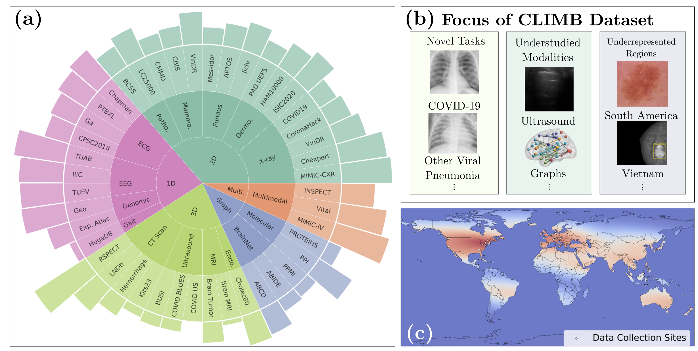
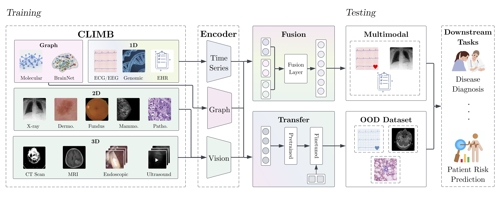

# CLIMB: Clinical Large-scale Integrative Multi-modal Benchmark

CLIMB is a comprehensive multimodal clinical benchmark that unifies diverse medical data across imaging, language, temporal, and genomic modalities. This framework enables holistic assessment of patient health by leveraging multiple data types and demonstrating significant improvements in clinical task performance.

This dataset framework is built on top of the [BenchMD](https://github.com/rajpurkarlab/BenchMD) repo, with redesigned datasets and models from EEG, pathology, mammography, X-ray, and other clinical domains. 

We also built a downloader framework so that you can download datasets with gated access easily. The downloader framework currently supports all datasets on PhysioNet, Github and Kaggle, with more to come.





## Dataset Overview

CLIMB comprises:
- 4.51 million patient samples
- 19.01 terabytes of total data
- Data from 33 medical institutions
- 96 different clinical conditions
- 13 clinical domains

A list of the datasets included in CLIMB can be found in the [Dataset Info](Dataset_Info.md). 

# How to download

## Installing dependencies

As the first step, please install the required dependencies via
```
pip install -r requirements.txt
```

## Downloading entire dataset
Create an object of the corresponding dataset class. An example is shown below.
```
d = BinaryBrainTumorDataset(base_root='data', download=True)
```
If we run this code from the root directory, the dataset will be downloaded to the 'data' directory.
Each dataset will be in its own directory, and the dataset directories are categorized by modality.
For example, Brain Tumor 2 will be downloaded to `data/mri/brain_tumor_2`.

To see other ways to download the dataset, please refer to the [Download Instructions](DOWNLOADER.md).

### Data Distribution

- 40.56% - 3D/Video samples (ultrasounds, CT scans, endoscopic images, MRI images)
- 22.90% - Multimodal data combinations
- 19.31% - 1D data (EHR, EEG, ECG, gait and genomic data)
- 15.68% - 2D imaging data (X-rays, dermoscopy, fundus images, pathology slides)
- 1.54% - Graph data (brain networks, molecules)

## Folder Structure

- `fusion`: Code for multimodal fusion strategies
- `models`: Vision, EEG, and ECG encoders
- `src`: Dataset collection and preprocessing scripts
